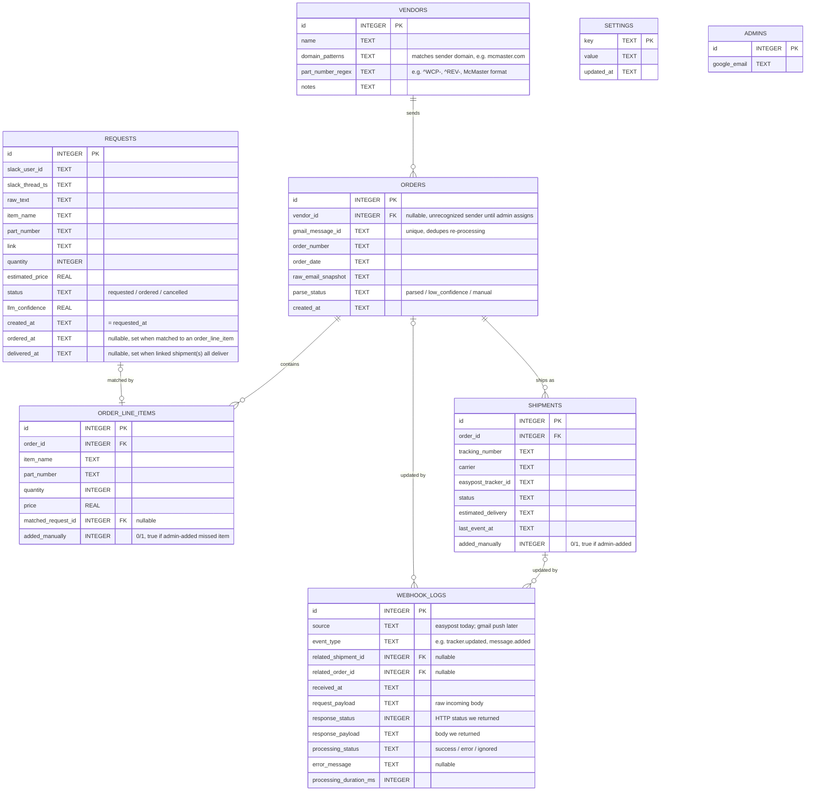

# PO Bot — Design Spec

**Date:** 2026-07-14
**Status:** Approved for implementation planning

## Overview

PO Bot helps an FRC (FIRST Robotics Competition) team's purchasing mentor manage part requests and order tracking with minimal manual effort. Students request parts via Slack; the mentor places orders through normal vendor channels (unchanged); the app auto-detects order confirmations and tracking numbers from a Gmail label and surfaces live shipment status on a public dashboard, so students can see when their parts will arrive without asking.

**Non-goals:** PO Bot does not place orders itself, does not handle payment/budget approval workflows, and does not manage inventory once items are delivered.

## Architecture & Tech Stack

- **SvelteKit** deployed to **Cloudflare Workers** via `adapter-cloudflare`.
- **D1** (SQLite) for all relational data.
- **Slack Events API** (HTTP-based; Workers can't hold a Socket Mode connection) receives `@PO Bot` mentions and thread replies.
- **Workers AI** performs two LLM extraction tasks: (1) parsing free-text Slack requests into structured data, (2) parsing vendor order-confirmation/tracking emails into structured order data.
- **Gmail API + OAuth**, not raw IMAP — Workers can't hold a persistent IMAP socket cleanly, and Gmail's REST API is a better fit. A **Cron Trigger** polls the `Orders` Gmail label (a label the mentor maintains via Gmail filters, already scoped to known vendors) every ~10 minutes for new messages.
- **EasyPost** provides real-time tracking. Tracking numbers are registered with EasyPost on creation; EasyPost pushes status changes to a `/webhooks/easypost` Worker endpoint.
- **Google OAuth** authenticates admin users against a `admins` allowlist table. The public board requires no login.

```
Slack mention → Workers AI parse → validate (part# or link) → confidence check → D1 (Requested)

Gmail poll (Cron) → Workers AI parse → group into order+line items
    → exact part# match → auto-move to Ordered
    → no match → Needs Review queue (admin resolves manually)

Order gets tracking # (auto-detected or admin-added) → register with EasyPost
EasyPost webhook → verify signature → log to webhook_logs → update shipment status → board reflects Shipped/Delivered
```

**Future enhancement (not built in v1):** replace Gmail Cron polling with Gmail Push Notifications (`watch()` API + Google Cloud Pub/Sub → Worker webhook) for near-real-time ingestion. The ingestion logic (parse → group → match) is written as a standalone function so it can be called from either a cron handler or a future webhook handler without modification.

## Data Model



**Notes:**
- A `request`'s public board stage is derived from its own lifecycle plus its matched order/shipments: Requested (no match yet) → Ordered (matched to an `order_line_item`, no shipment yet) → Shipped (any shipment on that order is in transit) → Delivered (**all** shipments on the order are delivered — see the Tracking section for why this is per-order, not per-line-item). "Needs Review" is a separate, admin-only concept — it describes `order_line_items` with `matched_request_id IS NULL`, not a state a `request` itself enters; an unmatched request simply stays Requested until it's matched.
- `requests.ordered_at` / `delivered_at` are denormalized timestamps, stamped by the matching logic and the EasyPost webhook handler respectively, so stage-duration stats (requested→delivered, ordered→delivered) are a simple subtraction rather than a multi-table join at query time.
- `vendors.part_number_regex` validates a student-supplied part number at Slack intake time. A part number that doesn't match any known vendor pattern isn't accepted on its own — the bot asks for a link instead.
- `settings` is a flat key-value table for runtime-tunable knobs — starting with the Slack-parse confidence threshold — so they can change from the admin dashboard without a redeploy.
- `webhook_logs` has one nullable, real foreign key per referenceable entity (`related_shipment_id`, `related_order_id`) rather than a polymorphic reference, so referential integrity is enforced by D1. Adding a third source later (e.g. `related_request_id` for a future Gmail push event) is a one-column migration.
- `order_line_items.added_manually` and `shipments.added_manually` distinguish admin-entered records from auto-parsed ones, useful for the stats/observability views.

## Slack Request Flow

1. A student `@mentions` the bot with free text (e.g. "@PO Bot need 5x 60 tooth gear, mcmaster.com/..."). Workers AI extracts `item_name`, `quantity`, `part_number`, `link`, and a confidence score.
2. **Part number validation**: if a `part_number` was extracted, it's checked against every `vendors.part_number_regex` (`^WCP-`, `^REV-`, McMaster's format, etc.). A match is "validated."
3. **Intake requirement**: the request needs a validated part number *or* a link. If neither is satisfied, the bot replies asking specifically for a link, before anything is queued.
4. **Confidence check**: once part-number-or-link is satisfied, compare the LLM's confidence to `settings['slack_parse_confidence_threshold']` (default 0.5, admin-editable). At/above threshold → auto-add with a confirmation reply in-thread. Below threshold → bot asks the student to clarify before adding.
5. A student can reply "cancel" in the thread to cancel their own request (`status = cancelled`) — only honored from the original requester, and only while `status = requested`.

## Email Ingestion & Order Matching Flow

1. A Cron Trigger polls the `Orders` Gmail label every ~10 minutes for messages newer than the last processed one (tracked via a single-row sync cursor, not a modeled entity).
2. Each new message is parsed by Workers AI into vendor, order number, order date, and line items — typically one order per email, since items ordered from the same vendor in one purchase are usually grouped together.
   - If parsing confidence is low, the `orders` row is still created (`parse_status = low_confidence`) rather than dropped, and flagged for admin review.
   - If the sender isn't a recognized vendor, the order is still created with `vendor_id = NULL` for the admin to assign.
   - Genuinely non-order noise in the label is skipped and logged as `ignored`, not surfaced as a queue item.
3. **Matching**: for each line item, look for an open `request` (`status = requested`) with an exact `part_number` match.
   - Match found → set `matched_request_id`, set `requests.status = ordered`, stamp `ordered_at`.
   - No match → stays unmatched, surfaced in the admin Needs Review queue.
4. **Admin overrides** (Needs Review + order management, all feeding the same downstream matching/EasyPost logic as the automated path):
   - **Manual match** — pair an unmatched `order_line_item` to any open `request`, regardless of vendor (covers ordering a requested part from a different vendor than originally linked).
   - **Add missed line item** — manually add an `order_line_items` row to an existing order for anything the parser missed reading out of the email body.
   - **Manually add an order** — for order confirmation emails missed entirely (wrong label, unusual format, parse failure): admin enters vendor/order #/date and line items by hand.
   - **Manually add a shipment** — for tracking emails missed or never sent: admin attaches a tracking number + carrier to an order, which registers it with EasyPost the same as an auto-detected one.
5. Subsequent emails in the same Gmail thread carrying a tracking number for a known `order_number` create a `shipments` row and register it with EasyPost.

## Tracking (EasyPost) Flow

1. On shipment creation (auto-detected or manually added), register the tracking number + carrier with EasyPost and store `easypost_tracker_id`.
2. EasyPost calls `/webhooks/easypost` on every status change. The handler verifies the webhook signature (rejecting unsigned/invalid requests before processing), logs the call to `webhook_logs` (payload in/out, HTTP status, processing outcome, duration), then updates the matching `shipments` row (`status`, `last_event_at`, `estimated_delivery`).
3. **Known simplification**: shipments link to `orders`, not individual `order_line_items` — generally there's no way to know which box a specific part shipped in. A request only reaches the Delivered stage (and gets `delivered_at` stamped) once **every** shipment on its order is delivered, even if that student's specific item physically arrived earlier in a different box. This is a deliberate v1 trade-off, not an oversight — revisit only if it causes real confusion in practice.

## Dashboard

- **Public `/`** — read-only board (Requested / Ordered / Shipped / Delivered columns). Cards show item name, quantity, requester, part number/link, and for Shipped cards a compact tracking summary (carrier, latest status, estimated delivery).
- **Admin `/admin/*`** (Google OAuth, gated by the `admins` allowlist):
  - Needs Review queue — manual match, add missed line item
  - Manually add order / manually add shipment
  - Settings page — confidence threshold, vendor list + regexes
  - Webhook log viewer — filter by source/status/date, inspect payloads
  - Stats view — requested→delivered and ordered→delivered averages/medians, derived from `requests` timestamps

## Error Handling & Edge Cases

- **Low-confidence email parse**: still create the `orders` row, flagged for admin review, rather than silently losing an order.
- **Non-order noise in the label**: skip and log as `ignored`.
- **Duplicate Gmail processing**: `gmail_message_id` uniqueness constraint prevents double-inserting the same order.
- **Unrecognized vendor**: order created with `vendor_id = NULL`, admin assigns manually.
- **EasyPost webhook auth**: signature verified before any processing or logging of the payload as trusted.
- **Workers AI errors/rate limits**: retry with backoff; on repeated failure, fall back to the same manual-review path as low-confidence parses.

## Testing Strategy

- Vitest unit tests for deterministic logic: part-number regex validation, confidence thresholding, matching logic, multi-shipment aggregation.
- Miniflare/local D1 integration tests for the matching and webhook-handling flows end-to-end.
- LLM calls are non-deterministic — tests use recorded/stubbed Workers AI responses (fixtures), not live model calls in CI.
- Mocked EasyPost webhook payloads to test the handler and `webhook_logs` recording.
- Manual end-to-end pass in a staging Slack workspace before rollout.
